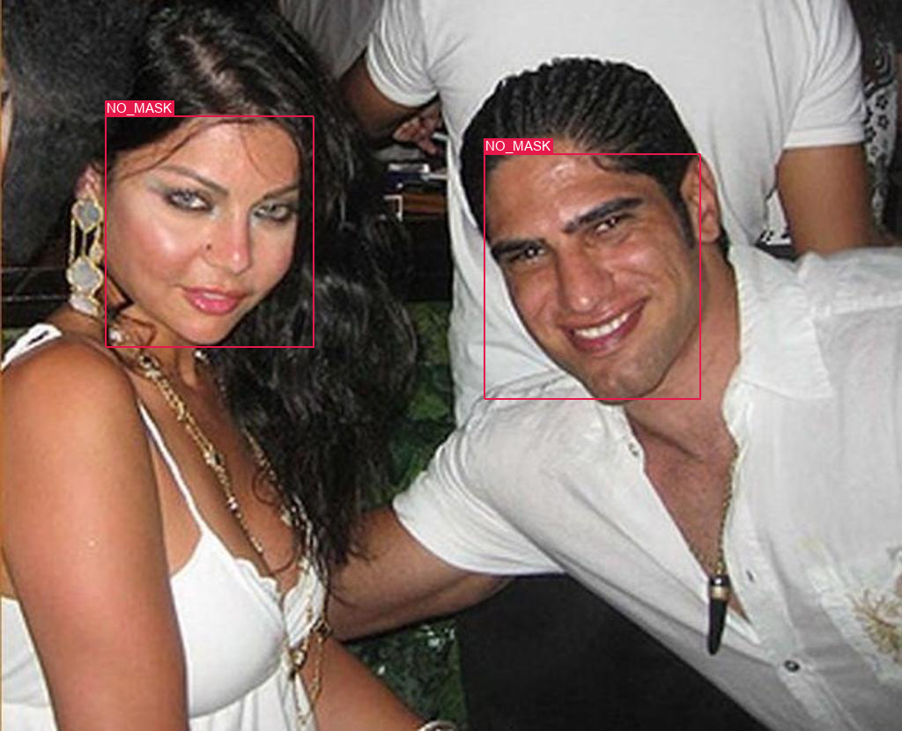

> The project was carried out in 2020.6 </br>

# Face Mask Detection

In this time of pandemic, people are constantly wearing masks while travelling outdoors. Hence, there is a need to detect faces with mask worn for security reasons. There are many methods to accomplish this objective. In particular, we will be exploring the YOLOv1 and YOLOv2. 

# Dataset 

To download the dataset, please run the following code:

`python download_dataset.py --dest=PATH_TO_DATASET`

Default `dest`=`./FaceMaskDataset`

# Requirement
To create a new conda environment for the remaining models, please run:

`conda env create --name yolo -f environment.yml`


### Download models and weights
To download models and weights for YOLOv1 and YOLOv2, please run the following code:

`
python models/download_models_weight.py --path=PATH_TO_MODELS
`

Default `path` is `"./"`.

# Train and Evaluate (YOLOv1)
To train or see some prediction results of the YOLOv1, please run the following code:

```
>>> python

>>> from models import YOLOv1

>>> from models.YOLOv1 import *

>>> YOLOv1.train()
>>> YOLOv1.prediction()
```

This command will take the first 3 images from test set and make predictions.
To make random prediction of 3 images from test set, run:

`YOLOv1.prediction(randpic=True)`


# Train and Evaluate (YOLOv2)
To train or see some prediction results of the YOLOv1, please run the following code:

```
>>> python

>>> from models import YOLOv2

>>> from models.YOLOv2 import *

>>> YOLOv2.train()
>>> YOLOv2.prediction()
```

This command will take the first 3 images from test set and make predictions.
To make random prediction of 3 images from test set, run:

`YOLOv2.prediction(randpic=True)`


# Visualization
---

<p align="center">

</p>

---

<p align="center">

</p>

---
