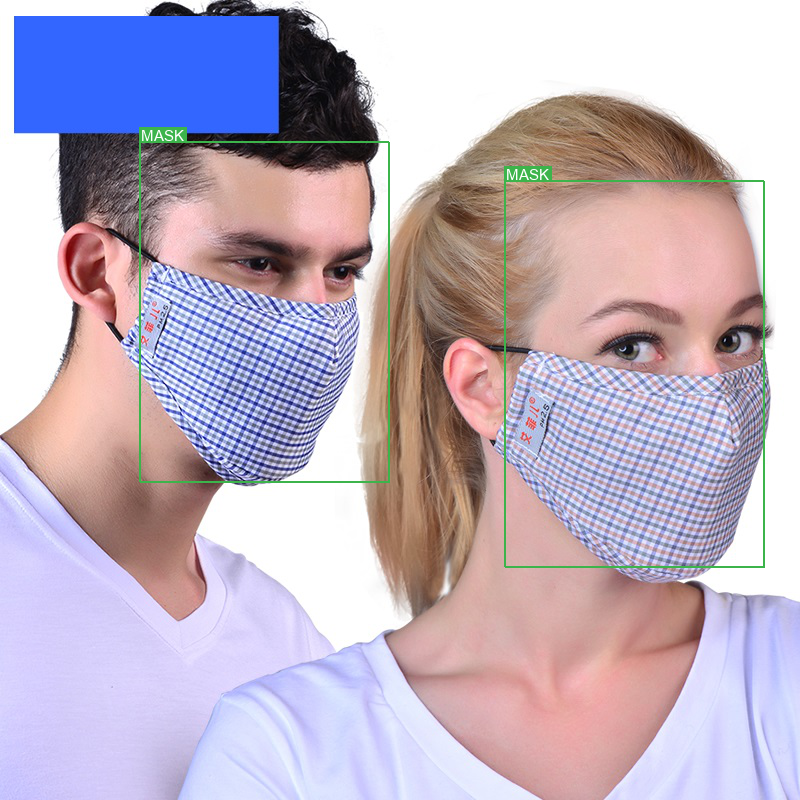

# Face Mask Detection
<!---
# Contents

[***Objective***](https://github.com/Ut0pi4/pytorch_ssd_linux#objective)

[***Dataset***](https://github.com/Ut0pi4/pytorch_ssd_linux#dataset)

[***Methodology***](https://github.com/Ut0pi4/pytorch_ssd_linux#methodology)

[***Implementation***](https://github.com/Ut0pi4/pytorch_ssd_linux#implementation)

[***Training***](https://github.com/Ut0pi4/pytorch_ssd_linux#training)

[***Evaluation***](https://github.com/Ut0pi4/pytorch_ssd_linux#evaluation)

[***Inference***](https://github.com/Ut0pi4/pytorch_ssd_linux#inference)

[***Frequently Asked Questions***](https://github.com/Ut0pi4/pytorch_ssd_linux#faqs)
-->
# Objective

In this time of pandemic, people are constantly wearing masks while travelling outdoors. Hence, there is a need to detect faces with mask worn for security reasons. There are many methods to accomplish this objective. In particular, we will be exploring the SSD, YOLOv1 and YOLOv2. 

# Dataset 

To download the dataset, please run the following code:

`python download_dataset.py --dest=PATH_TO_DATASET`

Default `dest`=`./FaceMaskDataset`

# Methodology
## YOLOv1, YOLOv2

### Requirement
To create a new conda environment for the remaining models, please run:

`conda env create --name yolo -f environment.yml`

### Download models and weights
To download models and weights for YOLOv1 and YOLOv2, please run the following code:

`
python models/download_models_weight.py --path=PATH_TO_MODELS
`

Default `path` is `"./"`.

### Train (YOLOv1)
To train the YOLOv1, please run the following code:

`python`

`from models import YOLOv1`

`YOLOv1.train()`

### Detect Results (YOLOv1)
To see some prediction results, please run the following code:

`python`

`from models import YOLOv1`

`from models.YOLOv1 import *`

`YOLOv1.prediction()`

This command will take the first 3 images from test set and make predictions.
To make random prediction of 3 images from test set, run:

`YOLOv1.prediction(randpic=True)`

### Train (YOLOv2)
To train the YOLOv2, please run the following code:

`python`

`from models import YOLOv2`

`from models.YOLOv2 import *`

`YOLOv2.train()`

### Detect Results (YOLOv1)
To see some prediction results, please run the following code:

`python`

`from models import YOLOv2`

`from models.YOLOv2 import *`

`YOLOv2.prediction()`

This command will take the first 3 images from test set and make predictions.
To make random prediction of 3 images from test set, run:

`YOLOv2.prediction(randpic=True)`

---
We will be implementing the [Single Shot Multibox Detector (SSD)](https://arxiv.org/abs/1512.02325), a popular, powerful, and especially nimble network for this task. The authors' original implementation can be found [here](https://github.com/weiliu89/caffe/tree/ssd).

Here are some examples of object detection in images not seen during training –

---

---

---

---

---

---

---

---

---

There are more examples at the [end of the tutorial](https://github.com/sgrvinod/a-PyTorch-Tutorial-to-Object-Detection#some-more-examples).

---
